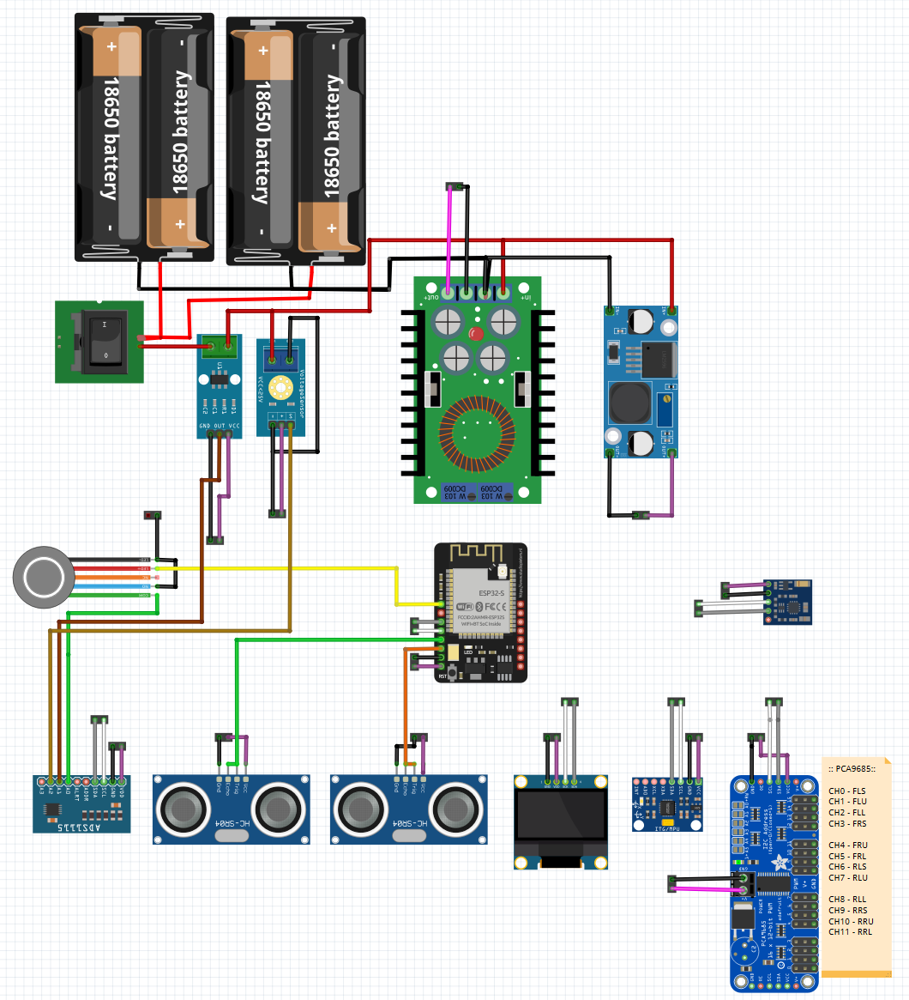

# Assembly and calibration

There exist a number of great resources for the assembly of the spot micro. For this reason I refer to these, as the steps are the same for this version:

- [Michael Kubina SpotMicroESP32 assembly](https://github.com/michaelkubina/SpotMicroESP32/tree/master/assembly)
- [Spot Micro AI assembly](https://spotmicroai.readthedocs.io/en/latest/assembly/)

## Calibration

Discussion about [Calibration](https://github.com/runeharlyk/SpotMicroESP32-Leika/discussions/118)

Assuming the servos are connected to the PCA9685 and is powered on:

### Calibrate in servo frame

1. Navigate to `/controller` and click on "Calibrate". This will set the servo to the center pwm value.
2. Navigate to `peripherals/servo` - Here you can control the servos individually.
3. If all your servos are the same kind, you can calibrate one and copy the configuration to the other ones.

We have to find a couple of values: min pwm, max pwm and conversion ratio.

**Min Pwm**

1. Select the servo you want to calibrate and move the pwm slider to where the servo stops moving. Then move it up and note the value where it starts moving again as $p_1$.

**Max Pwm**

1. Move the pwm slider up to where the servo stops moving. Then move it down until the servo starts moving again and note this value as $p_2$.

**Conversion ratio**

1. Now we have to find the conversion ratio, by looking at how much the servo move in deg per pwm. Move the pwm slider to the min pwm. Then mentally mark this as 0 deg. Move the pwm slider until the servo has moved 180 deg. Mark the pwm value $p_3$

Center pwm $=p_2 - p_2$
Conversion ratio $=(p_3 - p_1) / 180$

You now have the values for the servos.

### Calibration in body frame

They now has to calibrated to the body frame. It assumed they have the center pwm pointing straight down.

1. Navigate to `/controller` and click on "Calibrate". This will set the servo to the center pwm value.
2. Navigate to `peripherals/servo` - Here you can set the servo angle offset.

All the legs should be pointing down. If they are not you have to options. 1; Physically move the servos to the correct position by un screwing the servo horns. 2; Update the servo offset in the servo table.

## Circuit diagram

