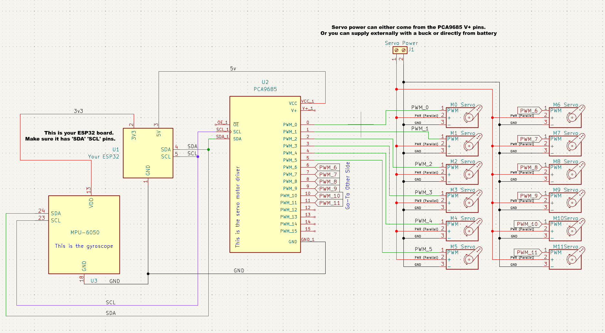

# Assembly and calibration

There are a number of great resources for the assembly of the Spot Micro. For this reason, I refer to these, as the steps are the same for this version:

- [Michael Kubina SpotMicroESP32 assembly](https://github.com/michaelkubina/SpotMicroESP32/tree/master/assembly)
- [Spot Micro AI assembly](https://spotmicroai.readthedocs.io/en/latest/assembly/)

## Calibration

Assuming the servos are connected to the PCA9685 and are powered on, and the robot runs firmware that reports its joint model.
Without it, the servo page shows a warning and cannot draw the expected pose; update the firmware first.

A variant fixes how its servos sit in the mechanical design: direction, centre angle and PWM per degree (`JointModel` in `esp32/include/joint_model.h`, selected by the variant the robot stores).
Choose the variant in the app first: until then the robot reports no joint model and does not wake the servos.
A robot stores only two values per joint: the PCA9685 channel that drives it and its centre PWM.
The centre PWM is the PWM at which the servo holds the joint's reference pose.

### Calibrate each joint

1. Navigate to `/peripherals/servo` (Peripherals, then Servo).
1. Check the channel of every joint in the table. Joint `j` is on channel `j` until you change it, and the channels must be distinct and between 0 and 15. A change is sent to the robot when the field loses focus.
1. Switch on "Active" to wake the PCA9685.
1. Select a joint with the joint slider. "All joints" drives every joint with the same PWM.
1. Move the PWM slider until the real joint lines up with the green dashed reference pose in the "Expected pose" diagram. The robot clamps every PWM to 125-600.
1. Click "Set centre PWM". This stores the slider value as the joint's centre PWM and uploads it. You can also type the value in the "Centre PWM" column.
1. Repeat for all twelve joints, then switch "Active" off.

The solid leg in the diagram is where the joint is at the current PWM, and the faint leg is where it is 20 PWM higher.
The real joint must move the same way as the faint leg when the PWM rises.
If it moves the other way, your build does not match the joint model of the chosen variant.

If a joint cannot reach its reference pose inside the PWM range, remove the servo horn and refit it one spline tooth over.

### Level the IMU

With an IMU detected and not disabled, open `/peripherals/imu` and click "Calibrate IMU" while the robot lies still and level.
The calibration fails if the robot moves, and a tilt above 15 degrees is not levelled.

## Circuit diagram

The PCA9685 and the IMU share the I2C bus of the ESP32.
The PCA9685 uses address `0x40`.
The default SDA and SCL pins depend on the PlatformIO environment:

| Environment            | SDA | SCL |
|------------------------|-----|-----|
| `esp32-camera`         | 14  | 15  |
| `esp32dev`             | 21  | 22  |
| `esp32-wroom-camera`   | 47  | 21  |
| `esp32-s3-n8r2`        | 47  | 21  |
| `seeed-xiao-esp32s3`   | 5   | 6   |
| `esp32-p4`             | 7   | 8   |

The pins and the bus frequency are stored in the peripheral settings and can be changed on `/peripherals/i2c`.

PCA9685 servo channels to joint, with the default channel map (joint `j` on channel `j`).
The firmware numbers the legs front right, front left, rear right, rear left, and each leg hip, upper limb (femur), lower limb (knee):

| PWM_0  | Front Right Shoulder (hip)         |
|--------|------------------------------------|
| PWM_1  | Front Right Upper-Limb (femur)     |
| PWM_2  | Front Right Lower-Limb (knee)      |
| PWM_3  | Front Left Shoulder (hip)          |
| PWM_4  | Front Left Upper-Limb (femur)      |
| PWM_5  | Front Left Lower-Limb (knee)       |
| PWM_6  | Rear Right Shoulder (hip)          |
| PWM_7  | Rear Right Upper-Limb (femur)      |
| PWM_8  | Rear Right Lower-Limb (knee)       |
| PWM_9  | Rear Left Shoulder (hip)           |
| PWM_10 | Rear Left Upper-Limb (femur)       |
| PWM_11 | Rear Left Lower-Limb (knee)        |
