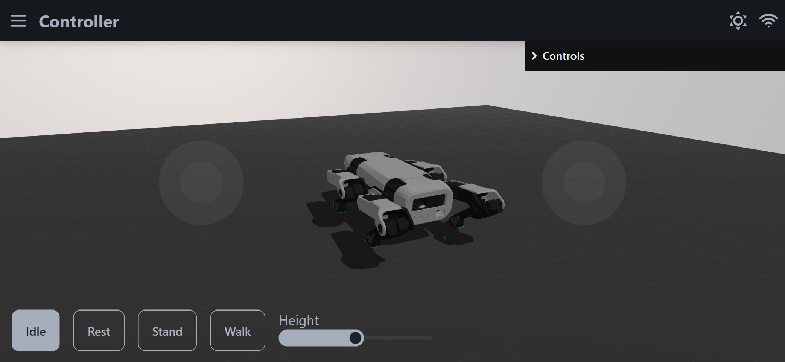

# Running the spot

### Start the Development Server

Use the following commands to launch the development server with Vite, enabling instant updates:

```sh
cd app
pnpm run dev
```

Please note that this example uses the `pnpm` package manager. For any other package manager such as `npm` or `yarn`, please adjust the command accordingly to run the dev command.

[Download the pnpm package manager from pnpm.io](https://pnpm.io/installation)
### Access the Vite server

Access the frontend via the browser link provided by Vite.<br>
Vite typically runs on port 5173, and can be accessed locally at [localhost:5173](http://localhost:5173/)

> *Prerequsition*: You have successfully built, flashed, and configured your robot.

Navigate to `/controller`



<!-- When the robot is in a safe position, click on Rest.
This will activate the servos and put the robot in the rest position. -->
