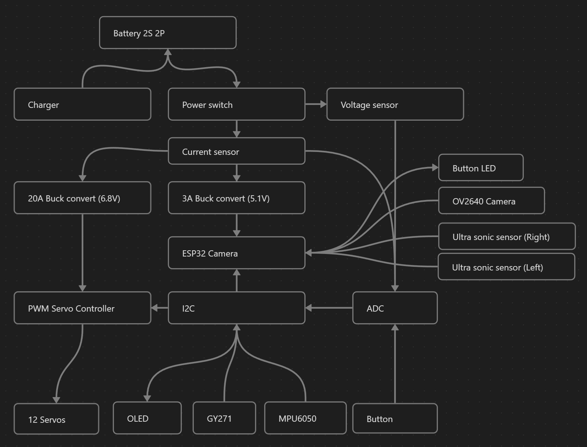

# Robot build

## Electronics

- ESP32 cam - Brain
- OV2640 160° - Camera
- PCA9685 - Servo board
- 12x 20kg(or higher) servo motors
- MPU6050 - Inertial measurement unit
- GY-271 - Magnetometer
- SZBK07 - 20A DC-DC Buck Converter
- LM2596 or XL4015 - DC-DC Stepdown Module
- 2x HC-SR04 - Ultrasonic Distance Sensor
- 0.96" SD1306 - OLED diplay
- ACS712 - Current sensor
- ADS1115 - 16 bit analog to digital converter
- Power button w/ led
- 4x 18650 Li-ion battery in 2P2S configuration
- Couple of resistors (10K, 47.7k, 33K)
- 4x Servo extension cables

