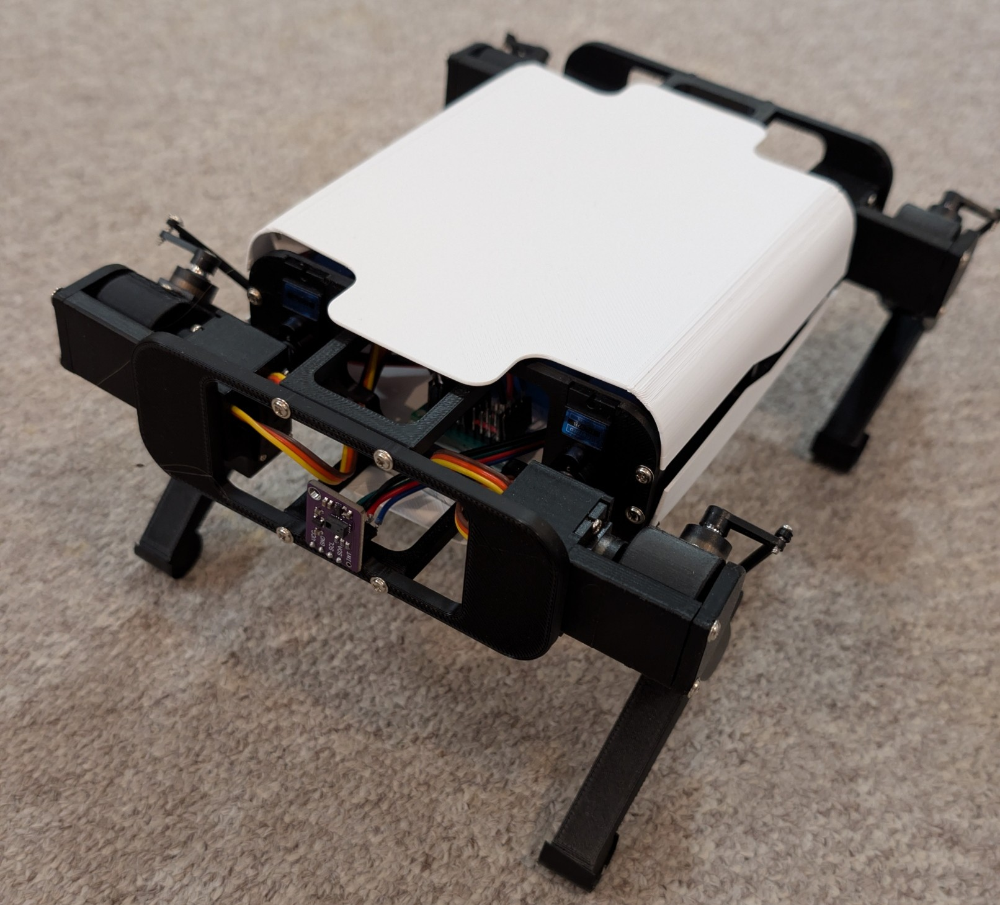

<div align="center">
  <h1>
    <a href="https://github.com/runeharlyk/SpotMicroESP32-Leika">
      
    </a>
    <br />  
    Spot Micro - Leika
  </h1>
  <h4>An ESP32-based quadruped robot platform with web based controller and pybullet simulator</h4>

  <p>
   <a href="docs/readme.md"><strong>Documentation</strong></a>
  </p>

[](https://github.com/runeharlyk/SpotMicroESP32-Leika/actions/workflows/frontend-tests.yml)
[](https://github.com/runeharlyk/SpotMicroESP32-Leika/actions/workflows/embedded-build.yml)

</div>

## Overview

Leika is an open-source quadruped robot built around the ESP32 microcontroller. The project combines embedded firmware, web-based control interfaces, and a physics-based simulation environment to create a complete robotics development platform. Using FreeRTOS for real-time task management, the robot handles inverse kinematics, gait generation, sensor fusion, and wireless communication simultaneously.

The project includes a PyBullet simulation environment for testing control algorithms and training reinforcement learning policies before deploying to hardware.


## Key Features

### Hardware & Firmware

- ESP32-based control system with FreeRTOS
- Inverse kinematics with 3-DOF legs
- Multiple gait implementations (Bezier trot, 8-phase crawl)
- Real-time sensor integration
<!-- - Over-the-air firmware updates -->
- Multiple hardware variants (standard, Yertle, and upcoming ✨Leika Mini✨)

### Web Controller

- Self-hosted web interface embedded in firmware
- Dual joystick control with real-time robot visualization
- Complete configuration interface (calibration, network, settings)
- Built with Svelte and embedded using LittleFS

### Simulation & Training

- PyBullet physics simulation with Gymnasium interface
- Reinforcement learning support (PPO, SAC)
- Parallel training infrastructure
- Model evaluation and comparison tools
- Interactive kinematics playground

## Architecture

### Control Flow

The robot implements a sense-plan-act control architecture:


1. **Sense**: Read IMU, magnetometer and gensture sensor
2. **Plan**: Process sensor data, compute inverse kinematics, generate gait trajectories
3. **Act**: Send servo commands, stream telemetry data

### Kinematics

The kinematics system allows control through Cartesian coordinates rather than raw joint angles. This abstraction simplifies motion planning and enables intuitive control.

The robot's body pose in the world reference frame:

$$T_{body}=\left[x_b,y_b,z_b,\phi, \theta,\psi\right]$$

Where:

- $x_b, y_b, z_b$ are Cartesian coordinates of the body center
- $\phi, \theta,\psi$ represent roll, pitch, and yaw angles

Foot positions in the world reference frame:

$$P_{feet}=\\{(x_{f_i},y_{f_i},z_{f_i})|i=1,2,3,4\\}$$

The inverse kinematics solver converts these high-level commands into joint angles for the 12 servos (3 per leg). The kinematics library is implemented in C++ for the ESP32 firmware and TypeScript for the web controller, enabling both real-time control and browser-based visualization.

### Web Controller

The web interface is built with SvelteKit and compiled to static assets that are embedded directly in the ESP32 firmware. This approach eliminates the need for external servers and ensures the controller is always synchronized with the firmware version.


Features:

- Real-time 3D robot visualization
- Dual joystick control with configurable input mapping
- Network configuration and WiFi management
- Servo calibration tools
- System monitoring and diagnostics
- Firmware over-the-air updates

## Motion Control

The motion system is implemented as a finite state machine supporting multiple locomotion modes:

### Available Gaits

**Trot Gait (12-Point Bezier)**

- Uses continuous phase time $t\in[0,1]$ with configurable swing/stance ratios
- Swing phase: 12-point Bezier curve for smooth foot trajectories
- Stance phase: Sinusoidal curve for body weight transfer
- Supports diagonal leg pairs moving in opposition
- Enables dynamic turning through trajectory modification

**8-Phase Crawl Gait**

- Static stability: three feet always on ground
- Sequential leg lifting with center-of-mass shifting
- Discrete phase transitions based on phase time accumulation
- Suitable for rough terrain and slow, stable locomotion
- Based on the implementation from [mike4192's spotMicro](https://github.com/mike4192/spotMicro)

**Static/Dynamic Posing**

- Direct body pose control without locomotion
- Used for manual positioning, rest states, and transitions

### Controller Input Mapping

| Input            | Parameter       | Range   |
| ---------------- | --------------- | ------- |
| Left joystick X  | Step length (X) | -1 to 1 |
| Left joystick Y  | Step length (Z) | -1 to 1 |
| Right joystick X | Turn angle      | -1 to 1 |
| Right joystick Y | Body pitch      | -1 to 1 |
| Height slider    | Body height     | 0 to 1  |
| Speed slider     | Step velocity   | 0 to 1  |
| S1 slider        | Step height     | 0 to 1  |
| Stop button      | Emergency stop  | 0 or 1  |

## Simulation Environment

A PyBullet-based physics simulation is available for algorithm development and reinforcement learning training:

```bash
cd simulation
pip install -r requirements.txt
python play.py
```

Features:

- Real-time interactive control with GUI
- Multiple terrain types (flat, heightmap, maze)
- Gymnasium-compatible interface for RL
- PPO and SAC algorithm support
- Parallel training capabilities
- Training scripts with TensorBoard integration

The simulation environment allows testing control algorithms and training policies before deploying to hardware. See [simulation/README.md](simulation/README.md) for detailed documentation.

## Hardware Variants

### Leika (Standard)

The original design supporting 12 servos with full 3-DOF leg control. Suitable for experimentation and learning about quadruped robotics.

### [Yertle](https://github.com/Jerome-Graves/yertle/tree/main)

A crossbreed between <a href="https://grabcad.com/library/diy-quadruped-robot-1">Kangal</a>, <a href="https://spotmicroai.readthedocs.io/en/latest/">SpotMicro</a> and <a href="https://github.com/adham-elarabawy/open-quadruped">Open Quadruped</a>

### Leika Mini (In Development)

A smaller and more affordable variant currently under development. Leika Mini aims to lower the entry barrier while being fully compatible with the platform.



## Hardware & Electronics

### Mechanical Components

The robot body is constructed from 3D-printed parts based on various Spot Micro community designs:

- [robjk reinforced shoulder remix](https://www.thingiverse.com/thing:4937631)
- [Kooba SpotMicroESP32 remix](https://www.thingiverse.com/thing:4559827)
- [KDY0532 original design](https://www.thingiverse.com/thing:3445283)

### Electronics

| Component        | Specification                   | Required    | Notes                                                 |
| ---------------- | ------------------------------- | ----------- | ----------------------------------------------------- |
| ESP32            | Microcontroller                 | Yes         | ESP32-S3 (N8R8) recommended for better performance    |
| PCA9685          | 16-channel PWM servo driver     | Yes         | Reinforce with thicker solder traces                  |
| 12x Servo motors | 20-36kg torque                  | Yes         | Minimum MG996R, highly recommend the pricer CLS6336HV |
| LM2596/XL4015    | DC-DC buck converter            | Yes         | Set to 5V for ESP32 and peripherals                   |
| MPU6050          | IMU (accelerometer + gyroscope) | Recommended | GY-87 or MPU-9250 include magnetometer                |
| HMC5883          | Magnetometer                    | Optional    | Included in GY-87/MPU-9250                            |
| PAJ7620U2        | Gesture sensor                  | Optional    | For interaction capabilities                          |
| OV2640/OV5640    | Camera module                   | Optional    | 120-160° FOV recommended                              |
| 2x HC-SR04       | Ultrasonic distance sensors     | Optional    | For obstacle detection                                |
| 0.96" SD1306     | OLED display                    | Optional    | Status display                                        |
| Battery          | 7.6-8.4V                        | Yes         | 4x 18650 in 2S2P or 2S LiPo                           |
| Power switch     | Main power                      | Yes         | Rated for battery current                             |

## Getting Started

### Hardware Build

Complete build instructions are available in the documentation:

1. [Components and BOM](docs/1_components.md)
2. [Assembly Instructions](docs/2_assembly.md)
3. [Software Installation](docs/3_software.md)
4. [Initial Configuration](docs/4_configuring.md)
5. [Running the Robot](docs/5_running.md)

### Firmware Development

**Prerequisites:**

- PlatformIO IDE or CLI
- Node.js 18+ (for web controller development)

**Build and flash:**

```bash
git clone https://github.com/runeharlyk/SpotMicroESP32-Leika
cd SpotMicroESP32-Leika

cd app
pnpm install
cd ..

pio run -t upload
pio run -t uploadfs
```

Configuration is managed through `factory_settings.ini` and `features.ini` in the `esp32/` directory.

### Simulation Only

To experiment with the simulation environments without hardware:

```bash
cd simulation
pip install -r requirements.txt
python play.py
```

For development workflows and contribution guidelines, see [docs/6_developing.md](docs/6_developing.md) and [docs/7_contributing.md](docs/7_contributing.md).

## Project Structure

```text
├── app/                    # SvelteKit web controller
├── docs/                   # Build and software documentation
├── esp32/                  # ESP32 firmware (PlatformIO)
│   ├── include/           # Firmware headers
│   ├── src/               # Firmware source
│   └── lib/               # Third-party libraries (TensorFlow Lite Micro)
├── simulation/             # PyBullet simulation environment
├── hardware/              # 3D printable parts and CAD files
├── scripts/               # Utility scripts
```

## Documentation

- [Software Architecture](docs/software_description.md)
- [API Reference](docs/api.md)
- [Kinematics Details](docs/kinematics.md)
- [Motion System](docs/motion_system.md)

## Roadmap

Track planned features and active development on the [project board](https://github.com/users/runeharlyk/projects/3). Report bugs or request features through [GitHub issues](https://github.com/runeharlyk/SpotMicroESP32-Leika/issues).

## Related Projects

If you're interested in quadruped robotics, check out:

- [mike4192's Spot Micro](https://github.com/mike4192/spotMicro) - ROS-based implementation with advanced features
- [SpotMicroAI](https://gitlab.com/public-open-source/spotmicroai) - Community hub for Spot Micro variants
- [Stanford Pupper](https://github.com/stanfordroboticsclub/StanfordQuadruped) - Another affordable quadruped platform
- [OpenQuadruped](https://github.com/adham-elarabawy/open-quadruped) - Research-focused quadruped project

## License

This project is licensed under the MIT License - see [LICENSE.md](LICENSE.md) for details.

## Contact

Rune Harlyk - [runeharlyk.dk](https://runeharlyk.dk)

Project Repository: [https://github.com/runeharlyk/SpotMicroESP32-Leika](https://github.com/runeharlyk/SpotMicroESP32-Leika)

<a href="https://bmc.link/runeharlyk" target="_blank"></a>
