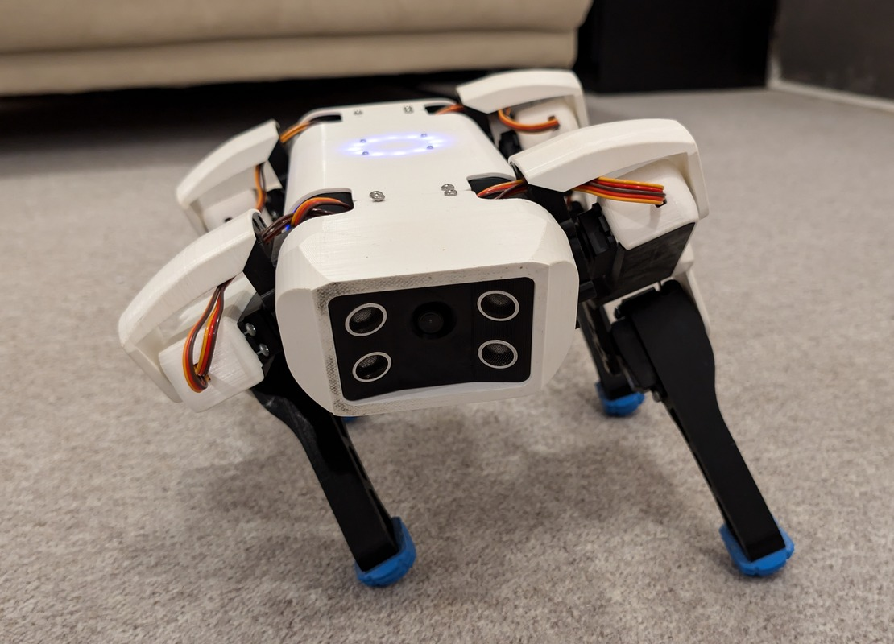
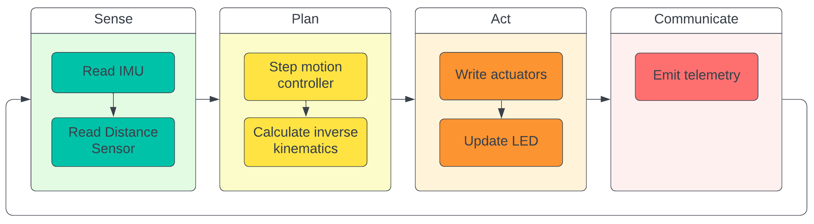

<div align="center">
  <h1>
    <a href="https://github.com/runeharlyk/SpotMicroESP32-Leika">
      
    </a>
    <br />  
    Spot Micro - Leika 🐕
  </h1>
  <h4>A small quadruped robot, inspired by Boston Dynamics <a href="https://bostondynamics.com/products/spot/" target="_blank">Spot</a>.</h4>

  <p>
   <a href="docs/readme.md"><strong>Explore the docs »</strong></a>
   <!-- <br/> -->
    <!-- <a href="#overview">Overview</a> •
    <a href="#features">Key Features</a> •
    <a href="#credits">Credits</a> •
    <a href="#license">License</a> -->
  </p>

[](https://github.com/runeharlyk/SpotMicroESP32-Leika/actions/workflows/frontend-tests.yml)
[](https://github.com/runeharlyk/SpotMicroESP32-Leika/actions/workflows/embedded-build.yml)

</div>

## 📜 Overview

Leika is a smaller quadruped robot for the Spot-Micro community.
Built on an ESP32 and powered by FreeRTOS, she can handle multiple tasks seamlessly—like video and data streaming, solving kinematic and gait planning, controlling I/O, and much more.
By focusing on practicality and simplicity in both hardware and software, it offer an accessible platform for learning, experimentation, and modest real-world applications.

## 🎯 Features

- **Live Preview**: Instant feedback with real-time updates.
- **Real-Time Data**: Stream camera feeds, monitor sensors, and analyze data on the fly.
- **Kinematic Precision**: Full kinematic model for accurate movements.
- **Dual joystick controller**
- **Robot mirroring visualization**
- **Highly customizable**
- **Self-Hosted**: Complete autonomy, from code to execution.
<!-- * Servo calibration tool -->

## 📐 Robot specifications

### 🌊 Robot control flow

The robots is implemented using a sense, plan, act control flow.



## 🦾 Kinematics

To enable complex movements, it's beneficial to be able to describe the robot state using a world reference frame, instead of using raw joint angles.

The robot's body pose in the world reference frame is represented as

$$T_{body}=\left[x_b,y_b,z_b,\phi, \theta,\psi\right]$$

Where

- $x_b, y_b, z_b$ are cartesian coordinates of the robot's body center.
- $\phi, \theta,\psi$ are the roll, pitch and yaw angles, describing the body orientation.

The feet positions in the world reference frame are:

$$P_{feet}=\\{(x_{f_i},y_{f_i},z_{f_i})|i=1,2,3,4\\}$$

where $x_{f_i}, y_{f_i}, z_{f_i}$ are cartesian coordinates for each foot $i$.

Solving the inverse kinematics yields target angles for the actuators.

<!-- Write about the calculation, rotation matrix and trig -->

<!-- L1, L2, L3, L4, L, W -->

<!-- $$
R_{body} =
\begin{bmatrix}
\cos\psi\cos\theta & \cos\psi\sin\theta\sin\phi - \sin\psi\cos\phi & \cos\psi\sin\theta\cos\phi + \sin\psi\sin\phi \\
\sin\psi\cos\theta & \sin\psi\sin\theta\sin\phi + \cos\psi\cos\phi & \sin\psi\sin\theta\cos\phi - \cos\psi\sin\phi \\
-\sin\theta & \cos\theta\sin\phi & \cos\theta\cos\phi
\end{bmatrix}
$$ -->

### 🎮 Controller

The controller is a Svelte app, which get embedded in the firmware of the robot.
Which means that new releases and OTA updates include the latest controller.

The controller includes full control over robot settings like network and calibration, and a visualization.


### 🛠️ Documentation

You can find the current steps to get a fresh new doggo up and barking on [/docs](docs/readme.md)

1. [Components](docs/1_components.md)
1. [Assembly](docs/2_assembly.md)
1. [Software](docs/3_software.md)
1. [First-time setup](docs/4_configuring.md)
1. [Running](docs/5_running.md)
1. [Developing](docs/6_developing.md)
1. [Contributing](docs/7_contributing.md)

#### 🎮 Software

You can find a description for the current esp32 firmware and controller [here](docs/software_description.md).

<!--## 🧠 Kinematics

The kinematic for the robot is from this [kinematics paper](https://www.researchgate.net/publication/320307716_Inverse_Kinematic_Analysis_Of_A_Quadruped_Robot). A C++ and TypeScript library was written to enable onboard calculation and fast development iteration using the robot mirroring.
-->

## 🏁 Motion state controller

The motion controller is a finite state machine with states allowing for static and dynamic posing, an 8-phase crawl, Bezier-based trot gait, and choreographed animation.

### Controller Input Mapping

The controller input is interpreted differently between the modes.

| Controller Input | Mapped to Gait Step | Range   |
| ---------------- | ------------------- | ------- |
| Left x joystick  | Step x              | -1 to 1 |
| Left y joystick  | Step z              | -1 to 1 |
| Right x joystick | Step angle          | -1 to 1 |
| Right y joystick | Body pitch angle    | -1 to 1 |
| Height slider    | Body height         | 0 to 1  |
| Speed slider     | Step velocity       | 0 to 1  |
| S1 slider        | Step height         | 0 to 1  |
| Stop button      | E stop command      | 0 or 1  |

<!-- ### Static and dynamic posing -->
### 8-phase crawl gait

The 8-phase crawl gait works by lifting one leg at a time while shifting its body weight away from the leg.

As the name implies, the gait consist of 8 discrete phases, which represents which feet should be contact the ground or be in swing.

At each time step the phase time $t\in [0,1]$ is updated. When $t\geq 1$ the phase index is updated and phase time is reset.

Is derived from [mike4192 spotMicro](https://github.com/mike4192/spotMicro)

### Trot gait (12 point bezier curve)

The trot gait implements a phase time $t\in[0,1]$, but instead of using contact phases we define a swing/stance ratio of phase time offset for each leg.

The stance controller implements a sin curve to control the depth of steps.

The swing controller implements a bezier curve using 12 control points centered around the robot leg.

Rotation is calulated using the same curve
## 🔮 Getting started

1. Clone and open the new project

   ```sh
   git clone https://github.com/runeharlyk/SpotMicroESP32-Leika
   ```

1. Install dependencies with preferable package manager (npm, pnpm, yarn)

   ```sh
   cd app
   pnpm install
   ```

1. Configure device settings

   1. Update `factory_settings.ini` with relevant settings

1. Upload filesystem image using platformIO

1. Upload firmware using platformIO

## 🚀 Future

See the [project backlog](https://github.com/users/runeharlyk/projects/3) and [open issues](https://github.com/runeharlyk/SpotMicroESP32-Leika/issues) for a full list of proposed and active features (and known issues).

## 🙌 Credits

This project takes great inspiration from the following resources:

1. [Spot Micro Quadruped Project - mike4192](https://github.com/mike4192/spotMicro)
1. [Kinematics](https://www.researchgate.net/publication/320307716_Inverse_Kinematic_Analysis_Of_A_Quadruped_Robot)
1. [ESP32SvelteKit template](https://github.com/theelims/ESP32-sveltekit)
1. [SpotMicro ESP32 - Maarten Weyn](https://github.com/maartenweyn/SpotMicro_ESP32)
1. [SpotMicroAi](https://gitlab.com/public-open-source/spotmicroai)
1. [Spot Micro - Leika](https://github.com/runeharlyk/SpotMicro-Leika/tree/main)
1. [NightDriverStrip](https://github.com/PlummersSoftwareLLC/NightDriverStrip)

## ☕ Support

If you like the project and want to follow its evolution, consider ✨-ing the project

<a href="https://bmc.link/runeharlyk" target="_blank"></a>

## You may also like...

- [Spot Micro Quadruped Project - mike4192](https://github.com/mike4192/spotMicro) - Great ROS based project
- [SpotMicroAi](https://gitlab.com/public-open-source/spotmicroai) - Group repository with simulations and runtimes

## 📃 License

[MIT](LICENSE.md)

---

> [runeharlyk.dk](https://runeharlyk.dk) &nbsp;&middot;&nbsp;
> GitHub [@runeharlyk](https://github.com/runeharlyk) &nbsp;&middot;&nbsp;
> LinkedIn [@Rune Harlyk](https://www.linkedin.com/in/rune-harlyk/)
