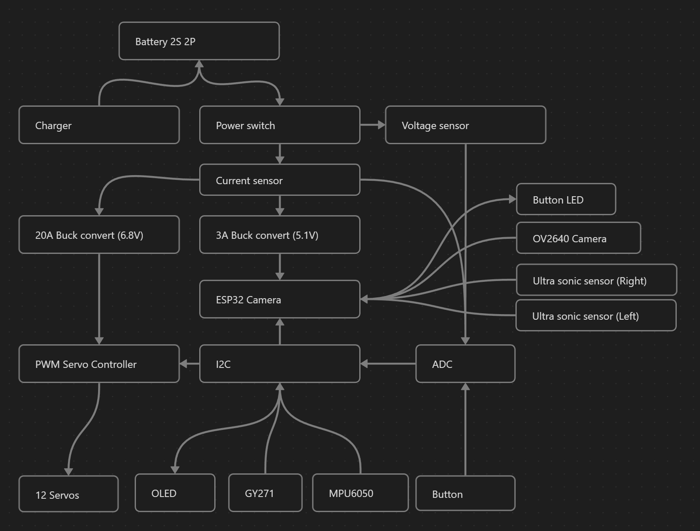

<h1 align="center">
  <br />
  <a href="https://github.com/runeharlyk/SpotMicroESP32-Leika">
    
  </a>
  <br>  
  Spot Micro - Leika
</h1>

<h4 align="center">A small quadruped robot, inspired by boston dynamic <a href="https://bostondynamics.com/products/spot/" target="_blank">Spot</a>.</h4>

<p align="center">
  <a href="#key-features">Key Features</a> •
  <a href="#overview">Overview</a> •
  <a href="#getting-started">Getting started</a> •
  <a href="#credits">Credits</a> •
  <!-- <a href="#external-links-and-references">Related</a> • -->
  <a href="#license">License</a>
</p>

<!-- GIF
 -->

## Status

<div style="display:flex;gap:20px">

[](https://github.com/runeharlyk/SpotMicroESP32-Leika/actions/workflows/frontend-tests.yml)
[](https://github.com/runeharlyk/SpotMicroESP32-Leika/actions/workflows/embedded-build.yml)

</div>

## Key Features

* Live preview - Make changes, See changes
* Real time data sync
  * Camera live stream
* Dual joystick controller
* Dark/Light mode
* Full screen mode
  * Immersive, distraction free.
* Self hosted, self included
<!-- * Servo calibration tool -->
<!-- * Full kinematic model -->

## Overview

This repository contains the complete source code for a Spot Micro quadruped robot.
Execution of the software takes place on a ESP32 cam, which runs various number of FreeRTos task for seamless robotic operations.
By focusing on practicality and simplicity in both hardware and software, it offer an accessible platform for learning, experimentation, and modest real-world applications.

<!-- The repo is based the following template: [ESP32-rapid-development-template](https://github.com/runeharlyk/ESP32-rapid-development-template) -->

### Electronics

* ESP32 cam - Brain
* OV2640 160° - Camera
* PCA9685 - Servo board
* 12x 20kg(or higher) servo motors
* MPU6050 - Inertial measurement unit
* GY-271 - Magnetometer
* SZBK07 - 20A DC-DC Buck Converter
* LM2596 or XL4015 - DC-DC Stepdown Module
* 2x HC-SR04 - Ultrasonic Distance Sensor
* 0.96" SD1306 - OLED diplay
* ACS712 - Current sensor
* ADS1115 - 16 bit analog to digital converter
* Power button w/ led
* 4x 18650 Li-ion battery in 2P2S configuration
* Couple of resistors (10K, 47.7k, 33K)
* 4x Servo extension cables

#### Connection Diagram



### Body

The robots is 3D printed and is a combination of different Spot Micro designs, with some minor modification on top.
The original design is developed by KDY0523.

* [robjk reinforced shoulder remix](https://www.thingiverse.com/thing:4937631)
* [Kooba SpotMicroESP32 remix](https://www.thingiverse.com/thing:4559827)
* [KDY0532 original design](https://www.thingiverse.com/thing:3445283)

The 3D prints is assembled with some additional component:

* 84x M2x8 screws + M2 nuts
* 92x M3x8 screws + M3 nuts
* 64x M3x20 screws + M3 nuts
* 12x 625ZZ ball bearings

### Software

The software make use of a range of different libraries to enhance the functionality.
Up to date list can be seen in platformio.ini file.
The libraries includes:

* Esp32SvelteKit
* PsychicHttp
* ArduinoJson
* Adafruit SSD1306
* Adafruit GFX Library
* Adafruit BusIO
* Adafruit PWM Servo Driver Library
* Adafruit ADS1X15
* Adafruit HMC5883 Unified
* Adafruit Unified Sensor
* UrlEncode
* MPU6050 light
* SPI

#### Structure

The software utilizes a couple of FreeRTos task
| Task | Description | Priority | Core
| --- | --- | --- | ---
| Idle0 task | Burns cpu time to track cpu usage for core 0 | 0 | 0
| Idle1 task | Burns cpu time to track cpu usage for core 1 | 0 | 1
| Spot service task | Handle synchronous services | 2 | 0

#### Feature flags

To dis-/enable the major feature I use defines. Define them in either featureflags.h or in platformio.ini's build_flags.
| Feature | Description | Default
| --- | --- | ---
| FT_BATTERY | Whether or not to use battery | 0
| FT_NTP | Whether or not to use time server | 1
| FT_SECURITY | Whether or not to use login system | 0
| FT_MQTT | Whether or not to use MQTT | 0
| FT_SLEEP | Whether or not include sleep management | 0
| FT_UPLOAD_FIRMWARE | Whether or not to use OAT | 0
| FT_DOWNLOAD_FIRMWARE | Whether or not to use github for firmware updates | 0
| FT_ANALYTICS | Whether or not to use analytics service | 1

### 📲 Controller

The controller is a SvelteKit app, which main focus is to calibrate and control the robot.
<!-- Write about the emulation, stream, controls and link to the space issues -->
It is made to be included and hosted by the robot.
Therefore there is placed a lot of thought behind the functionality and dependencies.

#### Development dependencies

For the development dependencies I choose the following

| Dependencies | Description
| --- | ---
| SvelteKit | SvelteKit is an application framework built on top of Svelte, enhancing it with features like routing, server-side rendering, and static site generation. It streamlines the development process by integrating server-side capabilities with Svelte's client-side benefits. Furthermore it make the development process fast and enjoyable.
| Vite | Vite is a frontend tool that is used for building fast and optimized web applications. Is serves code local during development and bundles assets for production
| Typescript | TypeScript's integration of static typing enhances code reliability and maintainability.
| Tailwind CSS | Tailwind CSS accelerates web development with its utility-first approach, ensuring rapid styling and consistent design.

#### Libraries

For the app functionality I choose the following:

| Dependencies | Description
| --- | ---
| [Three](https://www.npmjs.com/package/three) | Easy to use, lightweight, cross-browser, general purpose 3D library.
| [Urdf-loader](https://www.npmjs.com/package/urdf-loader) | Utilities for loading URDF files into THREE.js and a Web Component that loads and renders the model.
| [Xacro-parser](https://www.npmjs.com/package/xacro-parser) | Javascript parser and loader for processing the ROS Xacro file format.
| [NippleJS](https://www.npmjs.com/package/nipplejs) | A vanilla virtual joystick for touch capable interfaces.
| [Uzip](https://www.npmjs.com/package/uzip) | Simple, tiny and fast ZIP library.
| [ChartJS](https://www.npmjs.com/package/chart.js) | Simple and flexible charting library.

## Kinematics

The kinematic for the robot is from this [kinematics paper](https://www.researchgate.net/publication/320307716_Inverse_Kinematic_Analysis_Of_A_Quadruped_Robot)

## Getting started

1. Clone and open the new project

    ```sh
    git clone https://github.com/runeharlyk/SpotMicroESP32-Leika
    ```

1. Install dependencies with preferable package manager (npm, pnpm, yarn)

    ```sh
    cd app
    pnpm install
    ```

1. Configure device settings
    1. Update `factory_settings.ini` with relevant settings

1. Upload filesystem image using platformIO

1. Upload firmware using platformIO

## Usage

### Developing

1. Run the app

    ```sh
    cd app
    pnpm run dev
    ```

## Future

See the [open issues](https://github.com/runeharlyk/SpotMicroESP32-Leika/issues) for a full list of proposed features (and known issues).

## Credits

This project takes great inspiration from the following resources:

1. [Spot Micro Quadruped Project - mike4192](https://github.com/mike4192/spotMicro)
1. [Kinematics](https://www.researchgate.net/publication/320307716_Inverse_Kinematic_Analysis_Of_A_Quadruped_Robot)
1. [ESP32SvelteKit template](https://github.com/theelims/ESP32-sveltekit)
1. [SpotMicroAi](https://gitlab.com/public-open-source/spotmicroai)
1. [Spot Micro - Leika](https://github.com/runeharlyk/SpotMicro-Leika/tree/main)
1. [NightDriverStrip](https://github.com/PlummersSoftwareLLC/NightDriverStrip)

## Support

<a href="https://bmc.link/runeharlyk" target="_blank"></a>

## You may also like...

* [Spot Micro Quadruped Project - mike4192](https://github.com/mike4192/spotMicro) - Great ROS based project
* [SpotMicroAi](https://gitlab.com/public-open-source/spotmicroai) - Group repository with simulations and runtimes

## License

[MIT](https://github.com/runeharlyk/SpotMicroESP32-Leika/blob/master/LICENSE.md)

---

> [runeharlyk.dk](https://runeharlyk.dk) &nbsp;&middot;&nbsp;
> GitHub [@runeharlyk](https://github.com/runeharlyk) &nbsp;&middot;&nbsp;
> LinkedIn [@Rune Harlyk](https://www.linkedin.com/in/rune-harlyk/)
