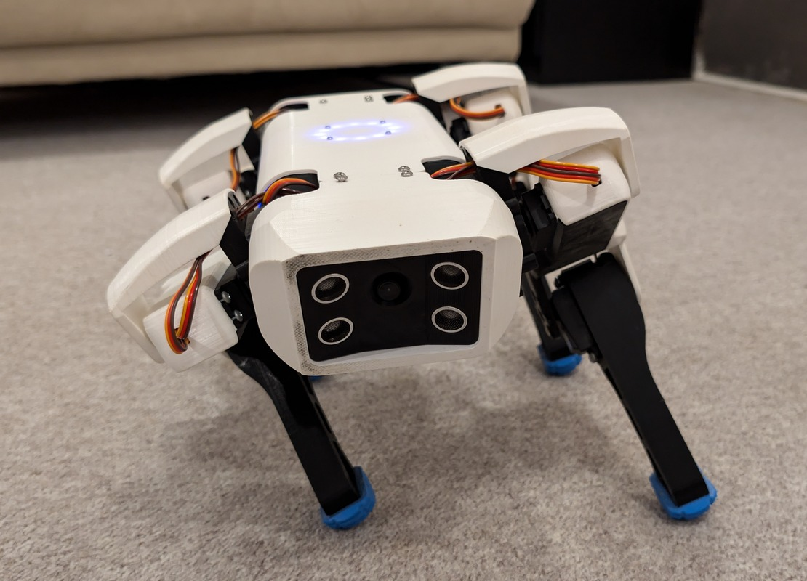
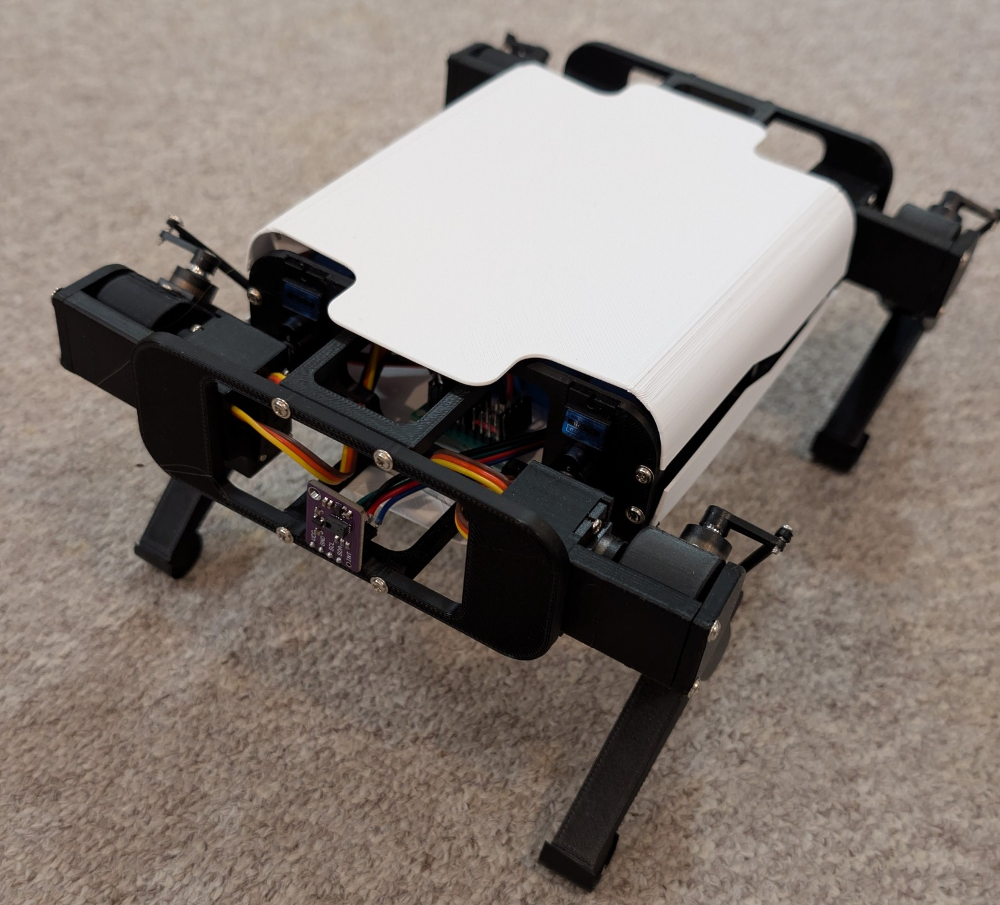
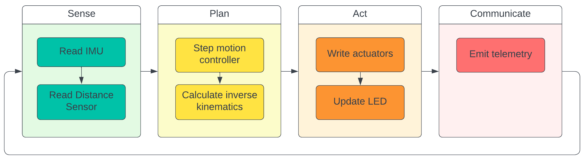

<div align="center">
  <h1>
    <a href="https://github.com/runeharlyk/SpotMicroESP32-Leika">
      
    </a>
    <br />  
    Spot Micro - Leika
  </h1>
  <h4>An ESP32-based quadruped robot platform with web based controller and MuJoCo simulator</h4>

  <p>
   <a href="docs/readme.md"><strong>Documentation</strong></a>
  </p>

[](https://github.com/runeharlyk/SpotMicroESP32-Leika/actions/workflows/frontend-tests.yml)
[](https://github.com/runeharlyk/SpotMicroESP32-Leika/actions/workflows/embedded-build.yml)
[](https://github.com/runeharlyk/SpotMicroESP32-Leika/actions/workflows/firmware-port-tests.yml)
[](https://github.com/runeharlyk/SpotMicroESP32-Leika/actions/workflows/simulation-tests.yml)

</div>

## Overview

Leika is an open-source quadruped robot built around the ESP32 microcontroller. The project combines embedded firmware, web-based control interfaces, and a physics-based simulation environment to create a complete robotics development platform. Using FreeRTOS for real-time task management, the robot handles inverse kinematics, gait generation, sensor fusion, and wireless communication simultaneously.

The project includes a MuJoCo simulation that ports the firmware walking gait to Python and trains a reinforcement learning policy to stabilize it.
One Python `Robot` API drives the simulation and the real robot over its WebSocket.
A recorder streams the real robot's telemetry to a file and reports it beside the simulation's assumptions.


## Key Features

### Hardware & Firmware

- ESP32-based control system with FreeRTOS
- Inverse kinematics with 3-DOF legs
- Multiple gait implementations (Bezier trot, 8-phase crawl)
- Body-frame IMU orientation for the ICM-20948, BNO055 and MPU6050 (Madgwick fusion, except on the BNO055, which fuses on the chip), with an optional separate compass
- Telemetry stream of every control tick: timing, IMU sample and servo command
- Multiple hardware variants (standard, Yertle, and upcoming ✨Leika Mini✨)

### Web Controller

- Self-hosted web interface, built with SvelteKit and embedded in the firmware with LittleFS, so it always matches the firmware version
- Dual joystick control with configurable input mapping and a real-time 3D view of the robot
- Network and WiFi configuration, system monitoring and diagnostics
- Servo calibration that draws each leg's expected pose, so a reversed or off-centre servo shows


### Simulation & Training

- MuJoCo physics simulation with a Gymnasium interface
- NumPy port of the firmware walk gait, so a zero policy action reproduces the robot's own gait
- Residual PPO policy (Stable-Baselines3) that learns small per-foot corrections on top of that gait
- Domain randomization and optional uneven terrain for sim-to-real robustness
- A `Robot` facade (`stand`, `move_forward`, `rotate`, `state`) with the same calls for the simulation and the real robot
- A telemetry recorder and report that compare the real robot's latencies and IMU noise with the ranges the simulation randomizes over

## Getting Started

### Build the Robot

Complete build instructions are available in the documentation:

1. [Components and BOM](docs/1_components.md)
2. [Assembly Instructions](docs/2_assembly.md)
3. [Software Installation](docs/3_software.md)
4. [Initial Configuration](docs/4_configuring.md)
5. [Running the Robot](docs/5_running.md)

### Flash from the Browser

Prebuilt firmware for every supported board can be installed from the [web flasher](https://runeharlyk.github.io/SpotMicroESP32-Leika/flash/) in Chrome or Edge, with no toolchain required.
Firmware is published there whenever a `v*` tag is released.

### Firmware Development

**Prerequisites:**

- PlatformIO IDE or CLI
- Node.js 20.19+ or 22.12+ and pnpm (the web controller is built and embedded into the firmware)
- `protoc` on `PATH` (generates the TypeScript protobuf bindings for the web controller)
- The `submodules/nanopb` submodule (clone with `--recurse-submodules`, or run `git submodule update --init --recursive`)

**Build and flash:**

```bash
git clone --recurse-submodules https://github.com/runeharlyk/SpotMicroESP32-Leika
cd SpotMicroESP32-Leika

cd app
pnpm install
cd ..

pio run -t upload
```

The first build creates `esp32/include/secrets.h` from `secrets.example.h`, which git ignores.
Put your WiFi network and the robot's access point password there, then build again.
Factory defaults such as the hostname are in `esp32/factory_settings.ini`; the variant and the sensors are configured in the app after flashing.

### Simulation Only

To experiment with the simulation without hardware, install [uv](https://docs.astral.sh/uv/) and run:

```bash
cd simulation
uv sync
uv run python replay_gait.py --vx 0.05   # watch the baseline firmware gait
uv run pytest -q                         # regression tests
```

For development workflows and contribution guidelines, see [docs/6_developing.md](docs/6_developing.md) and [docs/7_contributing.md](docs/7_contributing.md).

## Hardware

The robot body is 3D printed from community Spot Micro designs, and the electronics are an ESP32, a PCA9685 servo driver, 12 servos, a DC-DC converter and a 2S battery, with an optional IMU, compass, gesture sensor and camera.
The [component list](docs/1_components.md) has the parts, their credits and notes.

### Variants

The same firmware drives every variant: the app asks which one on the first connection (`SPOTMICRO_ESP32`, `SPOTMICRO_ESP32_MINI` or `SPOTMICRO_YERTLE`).
Each variant's dimensions and motion limits are in [docs/kinematics.md](docs/kinematics.md).

**Leika (Standard)**

The original design supporting 12 servos with full 3-DOF leg control. Suitable for experimentation and learning about quadruped robotics.

**[Yertle](https://github.com/Jerome-Graves/yertle/tree/main)**

A crossbreed between <a href="https://grabcad.com/library/diy-quadruped-robot-1">Kangal</a>, <a href="https://spotmicroai.readthedocs.io/en/latest/">SpotMicro</a> and <a href="https://github.com/adham-elarabawy/open-quadruped">Open Quadruped</a>

**Leika Mini (In Development)**

A smaller and more affordable variant currently under development. Leika Mini aims to lower the entry barrier while being fully compatible with the platform.



## How It Works

### Control Flow

The robot implements a sense-plan-act control architecture, followed by a communication step:



1. **Sense**: Read IMU, magnetometer and gesture sensor
2. **Plan**: Process sensor data, compute inverse kinematics, generate gait trajectories
3. **Act**: Send servo commands
4. **Communicate**: Stream telemetry data

### Kinematics

The kinematics system allows control through Cartesian coordinates rather than raw joint angles.
The body pose and the foot positions are expressed in the world reference frame, and the inverse kinematics solver converts them into joint angles for the 12 servos (3 per leg).
The library is implemented in C++ for the firmware and TypeScript for the web controller, enabling both real-time control and browser-based visualization.
See [docs/kinematics.md](docs/kinematics.md) for the maths.

### Motion Control

The motion system is a finite state machine with a 12-point Bezier trot, an 8-phase crawl (based on [mike4192's spotMicro](https://github.com/mike4192/spotMicro)), and static and dynamic posing.
See [docs/motion_system.md](docs/motion_system.md) for the gaits and the controller input mapping.

## Simulation Environment

The `simulation/` directory contains a MuJoCo environment for residual-gait reinforcement learning.
The baseline is a NumPy port of the firmware walk gait in `esp32/include/motion_states/walk_state.h`, so a zero action reproduces the gait the robot runs.
A PPO policy learns only small per-foot corrections on top of it, which keeps training focused on stabilization.

The simulated robot model is `spot_pico`, the hardware behind the firmware's `SPOTMICRO_ESP32_MINI` variant.
Exporting a trained policy to the ESP32 is not implemented yet.

`Robot("simulation")` and `Robot("<robot address>")` expose the same calls, so a script written against the simulation runs on the robot by changing its target.
`record.py` and `report_recording.py` capture the real robot's telemetry and compare it with the simulation's assumptions.
See [simulation/README.md](simulation/README.md) for the architecture, training options, the Robot API, recording and follow-ups.

## Project Structure

```text
├── app/                    # SvelteKit web controller
├── boards/                 # PlatformIO board definitions
├── docs/                   # Build and software documentation
├── flasher/                # Web flasher page and its firmware manifests
├── esp32/                  # ESP32 firmware (PlatformIO)
│   ├── include/           # Firmware headers
│   ├── src/               # Firmware source
│   ├── scripts/           # PlatformIO build scripts (web app embedding, proto generation)
│   └── test/              # Firmware tests that run on the host
├── platform_shared/        # Protobuf message definitions shared by firmware and app
├── simulation/             # MuJoCo training environment, Robot API and telemetry tools
├── hardware/              # 3D printable parts and CAD files
├── submodules/            # nanopb
```

## Documentation

- [Software Architecture](docs/software_description.md)
- [API Reference](docs/api.md)
- [Kinematics Details](docs/kinematics.md)
- [Motion System](docs/motion_system.md)

## Roadmap

Track planned features and active development on the [project board](https://github.com/users/runeharlyk/projects/3). Report bugs or request features through [GitHub issues](https://github.com/runeharlyk/SpotMicroESP32-Leika/issues).

## Related Projects

If you're interested in quadruped robotics, check out:

- [mike4192's Spot Micro](https://github.com/mike4192/spotMicro) - ROS-based implementation with advanced features
- [SpotMicroAI](https://gitlab.com/public-open-source/spotmicroai) - Community hub for Spot Micro variants
- [Stanford Pupper](https://github.com/stanfordroboticsclub/StanfordQuadruped) - Another affordable quadruped platform
- [OpenQuadruped](https://github.com/adham-elarabawy/open-quadruped) - Research-focused quadruped project

## License

This project is licensed under the MIT License - see [LICENSE.md](LICENSE.md) for details.
